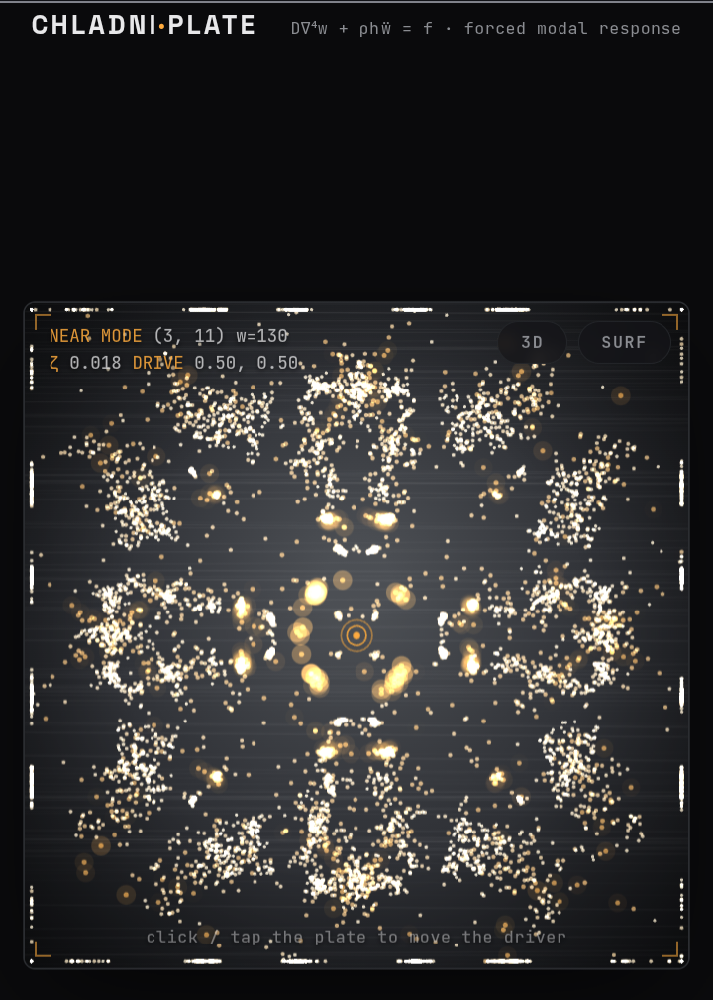

# Chladni Plate

**[Live demo → nazat02.github.io/Chladni-Plate](https://nazat02.github.io/Chladni-Plate/)**



An interactive simulation of Chladni figures — the nodal patterns sand forms on a vibrating plate — built from the actual forced-vibration physics of a thin square plate, not a pre-baked animation.

Tap the plate to move the driving point, drag the frequency slider through resonances, and watch the sand find the lines that never move.

---

## What's a Chladni plate?

In 1787, Ernst Chladni bowed the edge of a metal plate covered in sand and found that at certain frequencies the sand would leap away from the vibrating regions and collect along thin, perfectly still lines — the *nodes* of that frequency's vibration mode. The pattern changes completely as the frequency changes, tracing out a different symmetric figure at each resonance. It's one of the oldest and most direct ways to make sound visible.

This project simulates that: a real driven-plate model computed live in the browser, with virtual sand that responds to it the same way real sand does.

---

## Files

| File | Purpose |
|---|---|
| `index.html` | Landing page — explains the mechanism and physics, with a small self-cycling preview of the plate in the hero section and a gallery of sample nodal figures. |
| `simulation.html` | The actual interactive instrument — tap-to-drive plate, frequency slider, and 2D / 3D volumetric / 3D surface-graph views. |

Both pages are fully self-contained static HTML/CSS/JS (plus a CDN import of Three.js for the 3D views in `simulation.html`) — there's no build step and no backend.

---

## The physics

The plate is modeled as a thin, isotropic, simply-supported square (Kirchhoff–Love plate theory), governed by:

```
D∇⁴w + ρh ẅ = f(x, y, t)
```

**Why a plate rings differently than a string or drum:** because the governing operator is *biharmonic* (∇⁴, fourth-order) rather than the ordinary wave equation (∇², second-order), each eigenmode's natural frequency scales as:

```
ω_mn ∝ (m² + n²)
```

instead of `∝ √(m² + n²)` the way a membrane's would. That's why a plate's overtones don't fall into the neat harmonic ratios a string's do — and it's why the frequency readout in the app is labeled in these same natural units (Ω = m² + n² at exact resonance).

**Forced response.** Each mode is treated as an independent damped harmonic oscillator, driven at frequency Ω by a point force at (x₀, y₀):

```
q_mn(Ω) = φ_mn(x₀, y₀) / (ω_mn² − Ω² + i·2ζ·ω_mn·Ω)
```

where `φ_mn(x,y) = sin(mπx)sin(nπy)` is the mode shape. Summing every mode's contribution, weighted by this resonance response, gives the plate's actual steady-state displacement field at any drive frequency — not just an idealized snapshot of a single eigenmode.

**Symmetrizing the drive point.** A single point force at an arbitrary location has no particular symmetry, and its raw response is generically lopsided. Real Chladni figures look clean because the excitation effectively respects the plate's own symmetry. Rather than fake that visually, the simulation sums each mode's excitation over the drive point's full 8-point **D4 orbit** (identity + 90°/180°/270° rotations + 4 reflections) — physically equivalent to 8 synchronized point drivers placed symmetrically around the plate. This guarantees the field is invariant under the square's full symmetry group, wherever you actually tap.

**Sand transport.** Grains are agitated in proportion to local vibration amplitude and drift down the amplitude gradient toward the nearest still region — the standard phenomenological explanation for real Chladni figures (not a first-principles granular simulation, which is still an open research problem). Gradient descent plus amplitude-scaled jitter reproduces the correct qualitative and geometric result: grains collect on the zero set of the modal field, which is the actual definition of a nodal line.

**Parameters used** (in `simulation.html`):

| Symbol | Value | Meaning |
|---|---|---|
| `M` | 18 | modes summed per axis (18×18 = 324 mode pairs) |
| `ζ` | 0.018 | modal damping ratio (~1.8%, typical lightly-damped sheet metal) |
| Grid | 108×108 | field resolution |
| Sand grains | 9,000 (2D) / 42,000 (3D volumetric) | |

### The 3D views

- **Volumetric mode** extends the same idea into a cube using 3D standing waves `sin(lπx)sin(mπy)sin(nπz)`, symmetrized over the cube's 8 mirror reflections, with 42,000 particles so the resulting nodal *surfaces* (not just lines) read clearly in space.
- **Surface graph mode** renders the same 2D amplitude field as literal terrain height rather than particle density — a direct 3D plot of |w(x,y)|.

The volumetric mode is a stylized extension for visual/explanatory purposes rather than a literal acoustic cavity derivation (a true 3D cavity's modes follow a different, second-order wave equation) — see [Known simplifications](#known-simplifications--limitations) below.

---

## Using the simulator

- **Tap/click anywhere on the plate** to move the driving point — the field recomputes instantly.
- **Drag the frequency slider** (or use the **+ / −** step buttons) to sweep the drive frequency; tick marks on the slider mark the exact resonances Ω = m² + n².
- **RESCATTER** re-randomizes the sand (2D) or particle cloud (3D volumetric) so you can watch it settle again from scratch. In surface-graph mode there are no particles to reshuffle, so this instead re-triggers a brief "rise into resonance" reveal of the height map.
- **3D / SURF toggle buttons** switch between the flat 2D grain view, the volumetric particle-cloud view, and the 3D height-map surface graph. In either 3D mode, drag to orbit the camera, and tap the plate/surface to move the drive point.
- The readout in the corner (and the sidebar on larger screens) shows the current drive frequency Ω, the nearest resonant mode (m, n), the damping ratio ζ, and the drive coordinates.

---

## Known simplifications & limitations

In the interest of being upfront about where this departs from a rigorous physical model:

- **Sand transport is phenomenological**, not a discrete-element or first-principles granular simulation — the exact microscopic mechanism by which vibrated grains migrate to nodal lines is still active research. The gradient-descent-plus-jitter model used here reproduces the right *geometry* (grains end up on the true zero set of the field) without claiming to model individual grain collisions.
- **The mode (1,1) is deliberately excluded** from the landing page's animated hero rotation. It's the only mode whose entire nodal set is the plate's own outer border — it has no interior nodal line at all — which breaks the settle mechanic used everywhere else and produces an ugly, non-representative artifact rather than a clean figure. It's still shown correctly in the static gallery, which doesn't rely on that mechanic.
- **The 3D volumetric mode is a stylized analogy**, not a literal acoustic cavity simulation. It reuses the plate's biharmonic-style forced-response formula extended into three dimensions for visual/conceptual consistency, rather than deriving true 3D cavity resonance from the (second-order) wave equation, which would scale differently.
- **Edge amplitude flooring**: to keep sand from trivially piling into a plain picture-frame along the boundary (every mode is zero there), amplitude near the very edge is artificially floored above true zero. This is a deliberate visual trade-off, documented in the source, that sacrifices some literal accuracy right at the boundary in exchange for showing each mode's actual interior structure.

---

## Tech stack

- Vanilla HTML/CSS/JavaScript — no framework, no build step
- Canvas 2D for the flat plate and landing-page visuals
- [Three.js r128](https://threejs.org/) (via CDN) for the 3D volumetric and surface-graph views
- Google Fonts: Space Grotesk, JetBrains Mono

---

## Running locally

Everything is static, so any local server (or none at all) works:

```bash
git clone https://github.com/nazat02/Chladni-Plate.git
cd Chladni-Plate
python3 -m http.server 8000
# then open http://localhost:8000
```

Opening `index.html` directly via `file://` also works, though a local server avoids any browser restrictions on `fetch`/module loading if the project grows to need them.

---

## License

No license has been specified yet for this repository. If you'd like others to be able to reuse or modify this freely, consider adding an [MIT License](https://choosealicense.com/licenses/mit/) (or one of your choosing) via a `LICENSE` file at the repo root.
